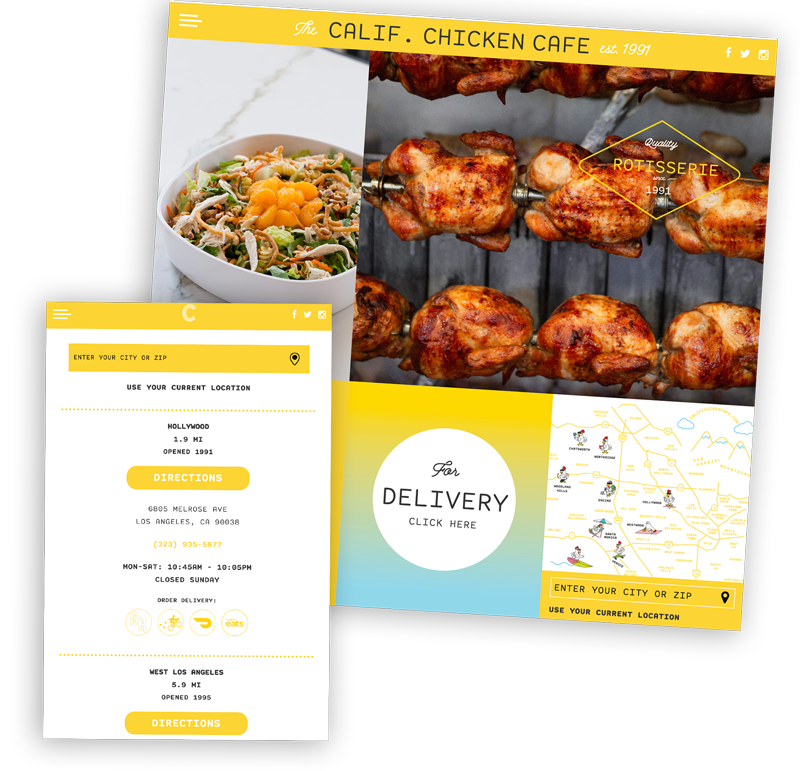
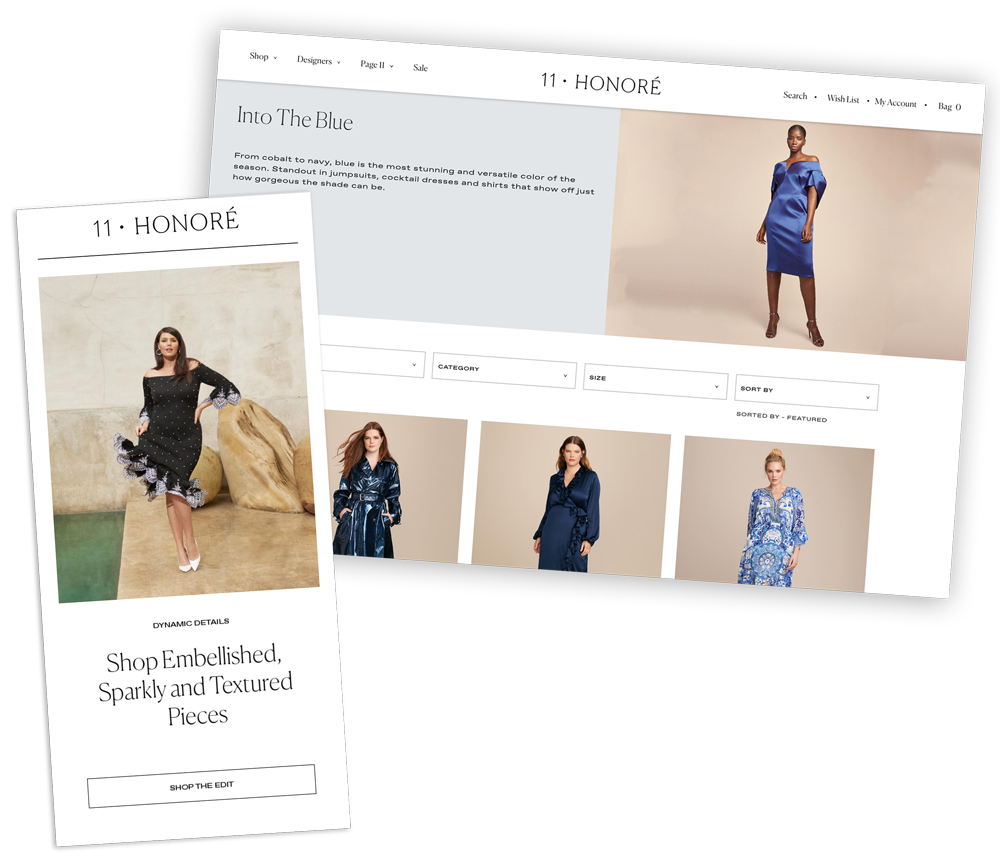
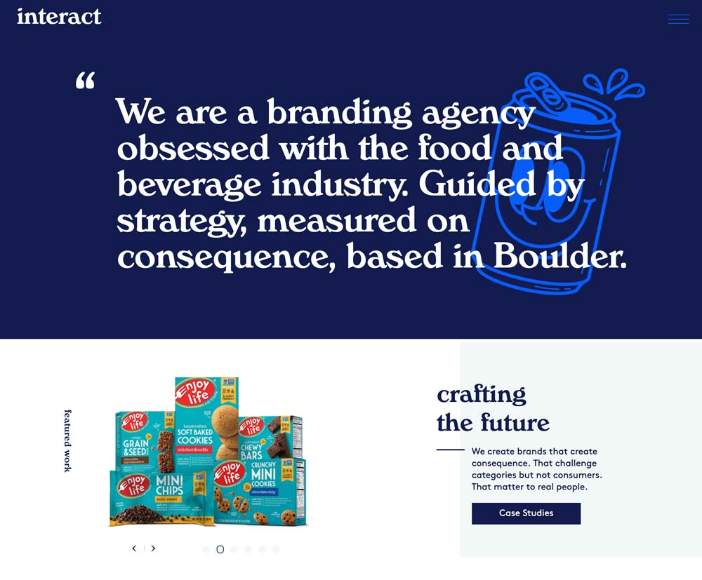
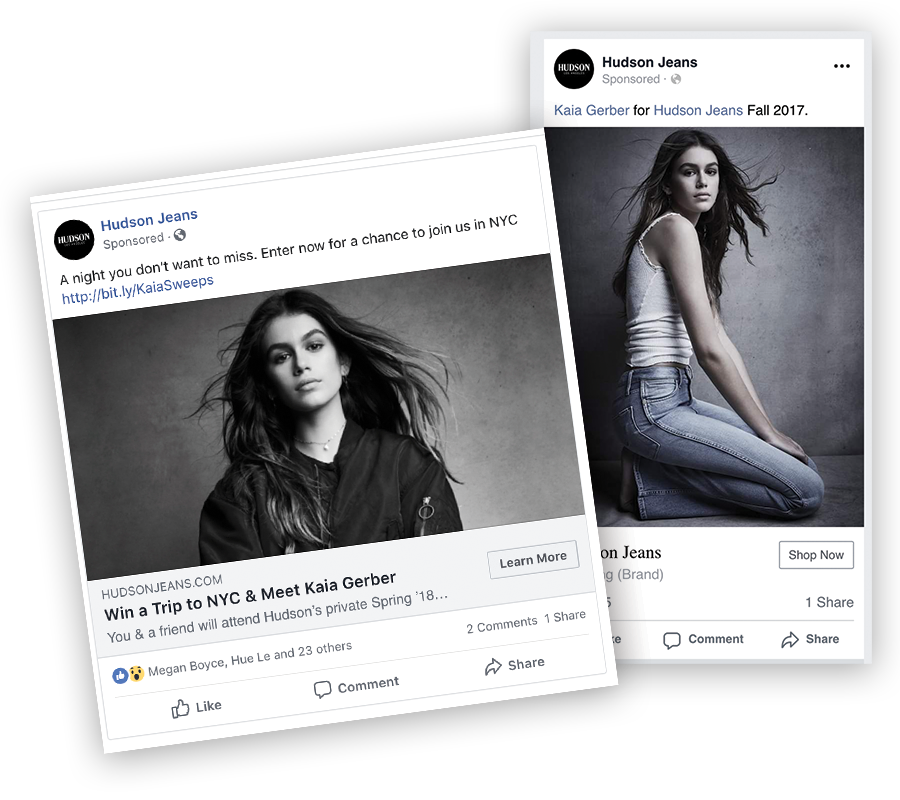

<!-- Main -->

<!-- One -->
<!-- <section id="one">
	

		<header class="major">
			<h2>11 Honore</h2>
		</header>
		
11 Honore CEO Patrick Herning, came to WE Creative with a vision for creating an e-commerce startup in an underserved market.

    
WE selected Shopify for their platform because of its extensibility and ease of use. Developing a custom theme and integrating the site with fulfillment, warehousing and marketing vendors. These integrations streamlined time spent managing the site so that the 11 Hon0re team could focus on serving their customers.

    
Once the site was launched WE managed, Email, Paid Search & Social Marketing, helping grow the site 20% Month over Month. 

	

</section> -->

<!-- Two -->
<section id="one" class="spotlights">
    <section>
    
    

      

        <header class="major">
          <h3>California Chicken Cafe</h3>
        </header>
          
When California Chicken Cafe revamped their brand concept, they came to us to create a digital experience that echoed their new identity.

          
WE used Wordpress as their content management system for its ease of use and well supported. WE built a custom theme which echoed their brand and is easily maintainable, allowing them to keep their menus and locations up to date as they expanded. 

          
WE incorporated the Google Maps API to build a branded search experience, allowing users to easily find the closest location and place an order. WE advised on user experience (UX) and site architecture, and performed an accessibility review to ensure that ADA compliance rules were met.
        

        <ul class="actions">
          <li><a href="https://califchickencafe.com" class="button next" target="blank">View the Site</a></li>
        </ul>
      

    

  </section>
	<section>
		
		

			

				<header class="major">
					<h3>11 Honoré</h3>
				</header>
				  
11 Honoré CEO Patrick Herning, came to WE Creative with a vision for creating an e-commerce startup in an underserved market.

            
WE helped take that vision into reality. WE selected Shopify for their platform because of its extensibility and ease of use. WE developed a custom theme and integrated site operations with business functions and logistics vendors.

            
Once the site was launched WE managed, Email, Paid Search & Social Marketing, helping grow the site 20% Month over Month. 
        

				<ul class="actions">
					<li><a href="https://11honore.com" class="button next" target="blank">View the Site</a></li>
				</ul>
			

		

	</section>
	<section>
		
		

			

				<header class="major">
					<h3>Interact Boulder</h3>
				</header>
				
Interact Boulder is a branding agency that works primarily in the Food & Beverage industry. They needed a website that showcased their status as an industry leader. 

        
WE worked with their design team to develop a custom Wordpress theme that features a fully modern frontend and migrated their old site in order to maintain SEO rankings for their important web articles.
        

				<ul class="actions">
					<li><a href="https://interactboulder.com" target="_blank" rel="noreferrer" class="button next">View the Site</a></li>
				</ul>
			

		

	</section>
	<section>
		
		

			

				<header class="major">
					<h3>HUDSON Jeans</h3>
				</header>
				
HUDSON tapped WE Creative to handle strategy and management for their paid social channels.

        
WE helped them optimize their spend and uncover new channels for promotion resulting in new customers and 6x Return on Investment.

				
			

		

	</section>
</section>

<!-- Three -->
<section id="two">
    

        <header class="major">
            <h2>See what WE can do for your brand.</h2>
        </header>
        
Great work begins with great relationships.
 
        
Let's set a time to talk about your brand and specific needs

        <ul class="actions">
          <li><a href="#contact" class="button next special scrolly">Contact Us</a></li>
        </ul>
    

</section>

